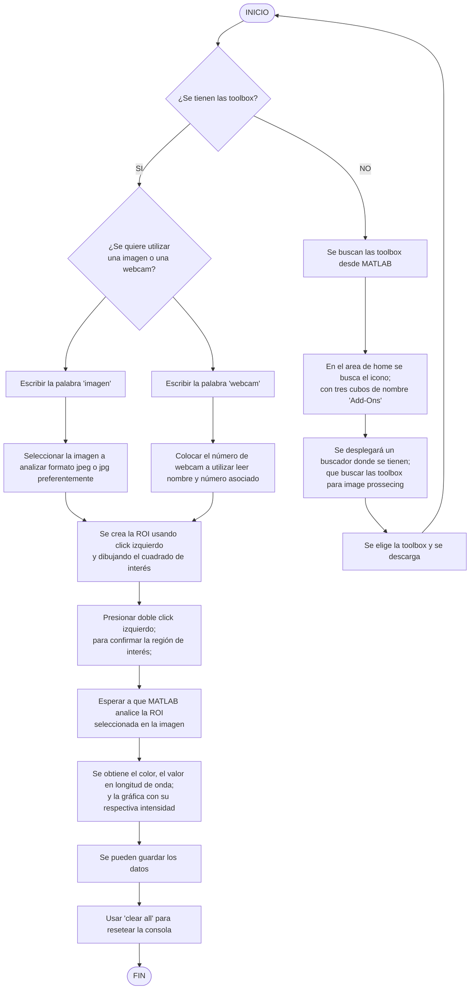

# Proyecto de construccion de un Espectroflurimetro casero
En el siguiente repositorio se encuentra el modelo 3D del montaje experimental así como el programa en MatLab para su uso libre (sí no se tienen las librerias descargasdas, matlab arrojará un error con instrucciones de intalación); también estan anexadas las intrucciónes de uso del programa. 

# Instrucciones de uso

